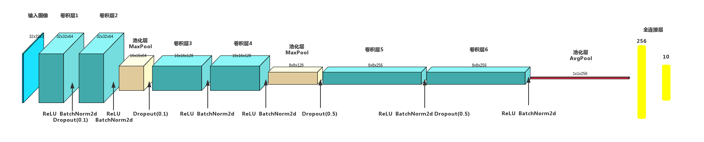
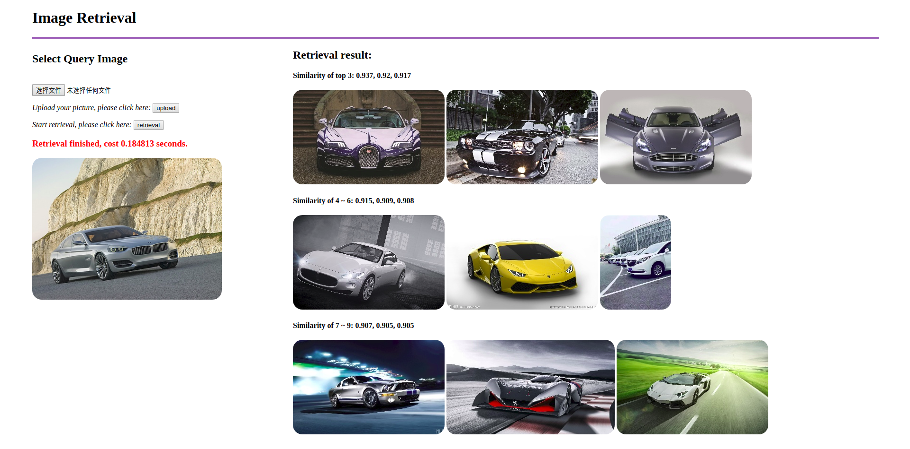
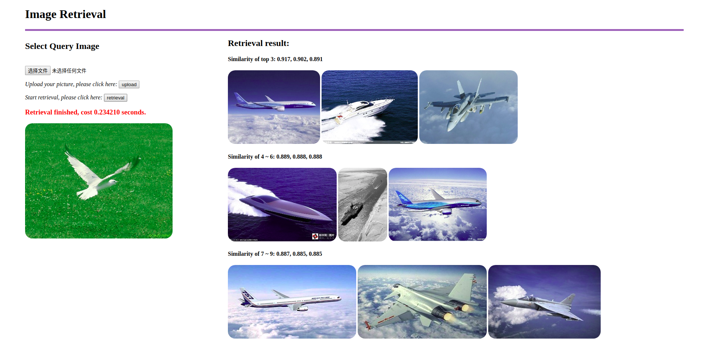

# Image Retrieval

- DataSet: CIFAR10, ResNet50, 1w Pictures collected by Web Crawler without label
- NetWork: Simple CNN(trained in CIFAR10), ResNet50(pretrained in ImageNet)

### Usage.

Please install `requirements.txt` first:

```shell
pip install -r requirements.txt
```

**Example 1**

> If you want a pre-trained model, you could get the pretrained CNN model from [this link](https://drive.google.com/open?id=1TG_Fq_UryffsmV045u4MJGaWB-MJqNgI)  (thanks [SongKaixiang/image_retrieval_platform](https://github.com/SongKaixiang/image_retrieval_platform))and put the model in path `./retrieval/models/`. Run the following command:

```python
python image_retrieval.py
# the first time, you shoud add --update to create the thumb_image and the feature of huge image dataset.
```

**Example 2**

We implemented a simple CNN on the CIFAR-10 dataset, which can be used to change the dataset to train and load models, the pre-trained model is saved in `/DaiNet/checkpoint/DaiNet/ckpt.t7`, already downloaded with the repo,  you could run it directly with the following command:

```python
python image_retrieval_DaiNet.py
```

**Others**

In the case that the database pictures are unchanged, you could choose to add parameters to control whether the feature vector is saved to speed up the startup, the default mode is to save features, use `--update` to force update, such as:

```
python image_retrieval.py --update
```

> but this feature is only implemented in `image_retrieval.py` 

**Success**

You will get the link in your terminal, like:

```shell
Running on http://127.0.0.1:8080/ 
```

You could specify the port in the code:

```python
if __name__ == '__main__':
    app.run(host='127.0.0.1', port=8080, debug=True)
```

**Directory Structure**

The pictures in the database are stored in `static/image_database`, and thumbnails will be generated in `thumb_images` to speed up web browsing. The queried pictures uploaded by users will be saved in `upload_image`, please note that only the current query pictures will be saved.

```shell
static
├── image_database
│   ├── 2008_000008.jpg
│   ├── ......
│   └── sheep_010.jpg
├── thumb_images
│   ├── 2008_000008.jpg
│   ├── ......
│   └── sheep_010.jpg
└── upload_image
    └── query.jpg
```


### Simple CNN (trained in CIFAR-10)



> More details you can see in https://github.com/MaxChanger/pytorch-cifar

In retreval_Dainet.py, we load DaiNet and its parameters, you can also change it to yours.

```python
def load_model(pretrained_model=None, use_gpu=True):

    net = dainet()
    checkpoint = torch.load(pretrained_model)
    net.load_state_dict(checkpoint['net'])
    net.fc1 = nn.Sequential()
    # print(net)
    net.eval()
    use_gpu = use_gpu and torch.cuda.is_available()
    if use_gpu:
        net = net.cuda()
    return net
```

### Results

```python
python image_retrieval.py	or	python image_retrieval_DaiNet.py
```



### TODO

- [ ] The accuracy of self-built Deainet on CIFAR-10 is close to 93%, but the result of training with ImageNet 	data set is not ideal.
- [ ] This network structure for precise classification may not be suitable for retrieval. Next, you may try Siamese or Triplet networks.


---------
> Here is the original project, the structure of the web page built by flask is very simple.
>
> Unfortunately, the original project did not provide the network structure and training process
>
> https://github.com/SongKaixiang/image_retrieval_platform
