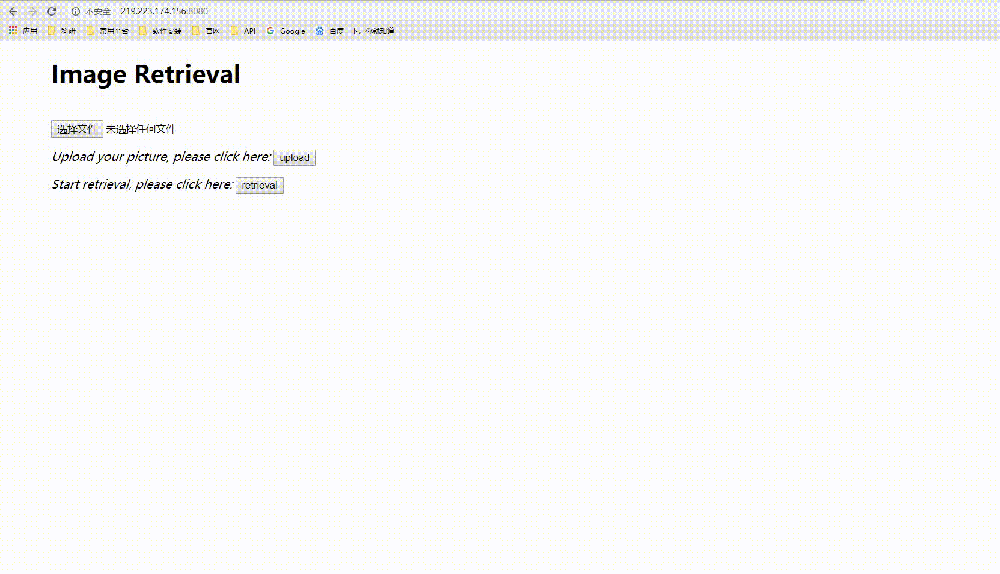

# Image Retrieval

- DataSet: CIFAR10, ResNet50, 1w Pictures collected by Web Crawler without label
- NetWork: Simple CNN( trained in CIFAR10), ResNet50(pretrained in imagenet)

### Simple CNN (trained in CIFAR10)


> more details you can see in https://github.com/MaxChanger/pytorch-cifar

In retreval_Dainet.py, we load DaiNet and its parameters, you can also change it to yours.

```python
def load_model(pretrained_model=None, use_gpu=True):

    net = dainet()
    checkpoint = torch.load(os.path.join('image_retrieval_platform/DaiNet/checkpoint', 'DaiNet', 'ckpt.t7'))
    net.load_state_dict(checkpoint['net'])
    net.fc1 = nn.Sequential()
    # print(net)
    net.eval()
    use_gpu = use_gpu and torch.cuda.is_available()
    if use_gpu:
        net = net.cuda()
    return net
```

### Result

```python
python image_retrieval.py	or	python image_retrieval_DaiNet.py
```


### TODO

- [ ] The accuracy of self-built Deainet on CIFAR-10 is close to 93%, but the result of training with ImageNet 	data set is not ideal.
- [ ] This network structure for precise classification may not be suitable for retrieval. Next, you may try Siamese or Triplet networks.


---------
> Here is the readme of the original project, the structure of the web page built by flask is very simple.
>
> https://github.com/SongKaixiang/image_retrieval_platform

> ## A simple image retrieval demo with pytorch and flask
>
> This is a simple demo of image retrieval based on pretrained CNN.
>
> ### Demo.
>
> The demo video is shown downside.
> 
>
> ### Usage.
>
> Please install requirements.txt first:
>
> ```
> $ pip install requirements.txt
> ```
>
> Get the pretrained CNN model from [this link](https://drive.google.com/open?id=1TG_Fq_UryffsmV045u4MJGaWB-MJqNgI)
> and put the model in path "./retrieval/models/".
>
> run the following command:
>
> ```
> $ python image_retrieval_cnn.py
> ```
>
> Your computer where the code run will work as a server, other terminals within the same LAN network can visit the website: "http://XXX.XXX.XXX.XXX:8080/", where "XXX.XXX.XXX.XXX" is ip of the server, type "ifconfig" in command widow to get it.
>
> ### Only Test.
>
> If you only want to test the retrieval proccess, just read the code image_retrieval_cnn.py for reference, and run the following command:
>
> ```
> $ cd retieval/
> $ python retrieval.py
> ```
>
> The sorted images will be printed.
>